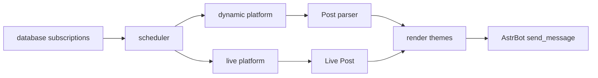

# 架构说明

本文档用于插件开发维护，也给后续模型改动提供边界说明。代码内尽量少写解释性注释，长期知识放在这里和各模块文档中维护。

## 插件定位

`astrbot_plugin_bilibili_push` 是 AstrBot 插件，用于：

- 订阅 Bilibili UP 主动态。
- 订阅 Bilibili 直播状态。
- 自动解析聊天中的 Bilibili 链接。
- 通过 Playwright/Jinja2 渲染图片卡片并发送到会话。

## 启动流程

1. AstrBot 加载 [main.py](main.py)，实例化 `BilibiliPush`。
2. 插件创建数据目录、临时目录、背景图目录。
3. 读取配置并通过 `core/config.py` 做类型兜底，初始化数据库、解析器、调度器、命令处理器和渲染适配器。
4. `initialize()` 设置全局 HTTP 客户端账号池，启动调度器和临时文件清理任务。
5. `terminate()` 停止调度器、取消清理任务、关闭浏览器和 HTTP client。

## 推送流程

## AI 与管理页

- AI 入口统一走 AstrBot LLM tools，`bili_workflow` 是推荐工具；分散 LLM tools 用作能力说明入口，实际业务仍汇入 workflow。
- `ai_dispatch` 会把规则候选和语义召回候选放在同一层交给 LLM 判断，识别自然语言意图、UP 查询词和订阅类型；失败、超时或低置信时回退到规则分流。
- B 站搜索返回候选后，AI 可继续参与候选分析，结合名称、搜索排序和粉丝数判断是否推进到确认卡；失败时回退确定性评分。
- 模糊 UP 名称会先生成候选和 pending task；AI/自然语言入口允许高置信候选自动推进到确认卡片，但不会绕过用户确认写库。
- UP 主简称和网络代称优先通过当前订阅、标签和 SQLite 历史别名解析；用户确认后会学习映射，减少后续重复搜索和候选验证。
- UP 解析采用可解释分层评分：明确 UID、当前会话订阅/标签、当前会话别名、全局用户名映射、跨会话共享证据、Bili 搜索兜底。分差过小或共享别名存在竞争 UID 时视为歧义，不自动推进。
- 自然语言和 AI 入口统一走 LLM tools；pending 续跑可以渲染 HTML 图片卡片，LLM tool 只返回稳定文本，避免把图片消息组件交给模型。
- Plugin Pages 当前落地 `pages/manager/`，用于订阅、账号、pending task 和手动直播检查管理，不承载模板预览和聊天 help。
- WebUI 新增订阅只负责把实例、群/个人类型和号码组装成完整 AstrBot `target_id`；订阅仍按 `uid + sub_type + target_id` 单会话粒度管理。
- WebUI 新增订阅可通过 `bilibili/user` 按 UID 拉取昵称和头像辅助确认，但仍不直接写库，保存按钮才提交订阅。
- WebUI 扫码登录通过 `webapi/manager_login.py` 获取二维码并轮询，成功后写入账号池；页面和接口都不回显 Cookie。

## 模块边界

- `main.py`: AstrBot 插件入口，只做装配、命令注册和生命周期管理。
- `_conf_schema.json`: AstrBot 插件配置页 schema；新增配置必须同步 `core/config.py` 和 README。
- `core/`: 跨模块基础类型、模型、HTTP 客户端、兼容层，详见 `core/core.md`。
- `database/`: SQLite 持久化，负责订阅、账号池和群/会话目标，详见 `database/database.md`。
- `dynamic/`: Bilibili 动态抓取、备用接口转换、动态内容解析，详见 `dynamic/dynamic.md`。
- `live/`: Bilibili 直播状态抓取、状态对比、直播 Post 构造，详见 `live/live.md`。
- `scheduler/`: 周期任务、去重、状态缓存、推送分发，详见 `scheduler/scheduler.md`。
- `handlers/`: 用户命令和链接事件处理，详见 `handlers/handlers.md`。
- `workflows/`: AI workflow 编排、pending task、工具参数解析，详见 `workflows/workflows.md`。
- `webapi/`: Plugin Pages 后端 API，详见 `webapi/webapi.md`。
- `pages/`: AstrBot Plugin Pages 静态页面，详见 `pages/pages.md`。
- `parser/`: 聊天消息中的 Bilibili 链接解析，详见 `parser/parser.md`。
- `rendering/`: 渲染端口和适配器，详见 `rendering/rendering.md`。
- `utils/renderers/`: 具体卡片主题，详见 `utils/renderers/renderers.md`。
- `resources/` 和 `utils/resources/`: 静态资源与模板，详见对应目录下的模块文档。
- `pages/manager/`: AstrBot WebUI 管理页，只做订阅、账号和 pending 状态管理，不承载聊天 help。

## 维护约束

- Python 文件应保持在 500 行以内；超过时优先按职责拆分模块。
- 身兼多职的模块应拆成职责子模块，主文件只保留对外入口和统合装配。
- 不在代码里堆大段架构说明；将背景知识写入 Markdown。
- 网络接口失败不能伪装为空结果，否则会污染动态去重缓存。
- 普通网络错误只允许请求级重试一次，不重跑整个 workflow；风控、限频和写操作失败不得自动循环补救。
- 订阅写入不要覆盖用户已有配置，重复订阅应明确返回已存在。
- SQLite 存长期业务数据，包括订阅、账号池和会话目标；KV 只存 pending、去重和直播状态这类短期状态。
- 用户简称类别名默认限定当前会话；跨群共享只记录为证据，必须多会话一致且无冲突才可辅助自动推进。
- 账号风控切换只轮换一次，避免跳过可用账号。
- 对外公共类名尽量保持稳定，例如 `BilibiliDynamic`、`BilibiliScheduler`。
- AI 工具不能凭模糊候选直接写库；高置信候选只能自动推进到确认节点，最终仍需用户确认。
- 语义召回、LLM 分流、搜索候选分析、实体解析和向量/别名检索都只能作为候选增强层，不得绕过确认边界。
- AI workflow 的 LLM tool 返回文本；pending 续跑可把同一结果渲染为 HTML 图片卡片。
- 解析统计属于运行态诊断，不写入 SQLite；长期业务数据仍限于订阅、账号、目标和别名。
- 解析视频附件只属于聊天链接解析的可选能力，默认关闭；订阅动态推送不得自动下载视频。
- Plugin Pages 写操作应走 `webapi/` service 层，不把 SQL 逻辑写到前端或命令 handler。

## 常见改动入口

- 新增命令：改 `main.py` 注册入口，并把业务放到 `handlers/`。
- 新增动态类型：优先改 `dynamic/post_parser.py`，必要时补 `core/models.py`。
- 调整推送策略：先看 `scheduler/scheduler.py` 入口，再改对应 checker 或 dispatcher。
- 调整直播状态判断：改 `live/bilibili.py`。
- 调整卡片样式：改 `utils/resources/templates/` 和 `utils/renderers/`。
- 调整账号或 Cookie 行为：改 `core/http.py` 和 `handlers/login_handler.py`。
- 调整 AI 接入：以 `workflows/` 为主，`handlers/ai_handler.py` 只做 LLM tool 适配。
- 调整 WebUI 管理页：改 `pages/` 和 `webapi/`，避免把页面逻辑写进命令 handler。

## 文档命名

- 总体架构文档使用 `ARCHITECTURE.md`。
- 模块说明使用模块名命名，例如 `dynamic/dynamic.md`、`scheduler/scheduler.md`。
- 二级模块也使用目录名命名，例如 `utils/resources/templates/templates.md`。

## 收尾验证

- 拆分检查：运行 `python scripts/check_workflow_integration.py`，其中包含全仓库文本文件 500 行限制检查。
- AstrBot 嵌入检查：运行 `python scripts/check_astrbot_embed.py`，对照本机 AstrBot 源码验证 Plugin Pages 发现规则、bridge API、`/api/plug` 转发和页面 endpoint 注册。
- 模板渲染检查：运行 `python scripts/generate_template_previews.py --output-dir template_previews/final_review`，输出透明底 HTML 卡片图片和总览图；该目录为生成产物，不纳入版本库。
- `metadata.yaml` 的 `name` 必须与 Web API 前缀一致，当前固定为 `astrbot_plugin_bilibili_push`。AstrBot Dashboard bridge 会拼接 `/api/plug/<pluginName>/<endpoint>`，此处不一致会导致页面嵌入后 API 找不到路由。
