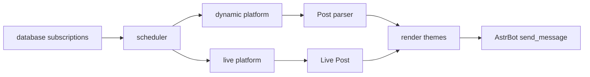

# 架构说明

本文档用于快速接手插件开发，也给后续模型改动提供边界说明。代码内尽量少写解释性注释，长期知识放在这里和各模块 README 中维护。

## 插件定位

`astrbot_plugin_bilibili_push` 是 AstrBot 插件，用于：

- 订阅 Bilibili UP 主动态。
- 订阅 Bilibili 直播状态。
- 自动解析聊天中的 Bilibili 链接。
- 通过 Playwright/Jinja2 渲染图片卡片并发送到会话。

## 启动流程

1. AstrBot 加载 [main.py](main.py)，实例化 `BilibiliPush`。
2. 插件创建数据目录、临时目录、背景图目录。
3. 初始化数据库、解析器、调度器、命令处理器和渲染适配器。
4. `initialize()` 设置全局 HTTP 客户端账号池，启动调度器和临时文件清理任务。
5. `terminate()` 停止调度器、取消清理任务、关闭浏览器和 HTTP client。

## 推送流程

## 模块边界

- `main.py`: AstrBot 插件入口，只做装配、命令注册和生命周期管理。
- `core/`: 跨模块基础类型、模型、HTTP 客户端、兼容层，详见 `core/core.md`。
- `database/`: SQLite 持久化，当前负责订阅数据，详见 `database/database.md`。
- `dynamic/`: Bilibili 动态抓取、备用接口转换、动态内容解析，详见 `dynamic/dynamic.md`。
- `live/`: Bilibili 直播状态抓取、状态对比、直播 Post 构造，详见 `live/live.md`。
- `scheduler/`: 周期任务、去重、状态缓存、推送分发，详见 `scheduler/scheduler.md`。
- `handlers/`: 用户命令和链接事件处理，详见 `handlers/handlers.md`。
- `parser/`: 聊天消息中的 Bilibili 链接解析，详见 `parser/parser.md`。
- `rendering/`: 渲染端口和适配器，详见 `rendering/rendering.md`。
- `utils/renderers/`: 具体卡片主题，详见 `utils/renderers/renderers.md`。
- `resources/` 和 `utils/resources/`: 静态资源与模板，详见对应目录下的模块文档。
- 计划新增 `workflows/`: AI workflow 编排、pending task、工具参数解析；落地前参考 `AI_WORKFLOW_REFACTOR_PLAN.md`。
- 计划新增 `pages/`: AstrBot Plugin Pages 前端页面；只放 WebUI 静态页面，不承载聊天 help。

## 维护约束

- Python 文件应保持在 500 行以内；超过时优先按职责拆分模块。
- 身兼多职的模块应拆成职责子模块，主文件只保留对外入口和统合装配。
- 不在代码里堆大段架构说明；将背景知识写入 Markdown。
- 网络接口失败不能伪装为空结果，否则会污染动态去重缓存。
- 订阅写入不要覆盖用户已有配置，重复订阅应明确返回已存在。
- 账号风控切换只轮换一次，避免跳过可用账号。
- 对外公共类名尽量保持稳定，例如 `BilibiliDynamic`、`BilibiliScheduler`。
- AI 工具写订阅前必须有明确 UID；搜索候选多于 1 个时应走 pending 确认。
- Plugin Pages 写操作应复用 workflow 或 service 层，不直接操作 SQLite。

## 常见改动入口

- 新增命令：改 `main.py` 注册入口，并把业务放到 `handlers/`。
- 新增动态类型：优先改 `dynamic/post_parser.py`，必要时补 `core/models.py`。
- 调整推送策略：先看 `scheduler/scheduler.py` 入口，再改对应 checker 或 dispatcher。
- 调整直播状态判断：改 `live/bilibili.py`。
- 调整卡片样式：改 `utils/resources/templates/` 和 `utils/renderers/`。
- 调整账号或 Cookie 行为：改 `core/http.py` 和 `handlers/login_handler.py`。
- 调整 AI 接入：先看 `AI_WORKFLOW_REFACTOR_PLAN.md`；落地后以 `workflows/` 为主，`handlers/ai_handler.py` 只做入口适配。
- 调整 WebUI 管理页：新增 `pages/` 和 Web API 适配层，避免把页面逻辑写进命令 handler。

## 文档命名

- 总体架构文档使用 `ARCHITECTURE.md`。
- 模块说明使用模块名命名，例如 `dynamic/dynamic.md`、`scheduler/scheduler.md`。
- 二级模块也使用目录名命名，例如 `utils/resources/templates/templates.md`。
