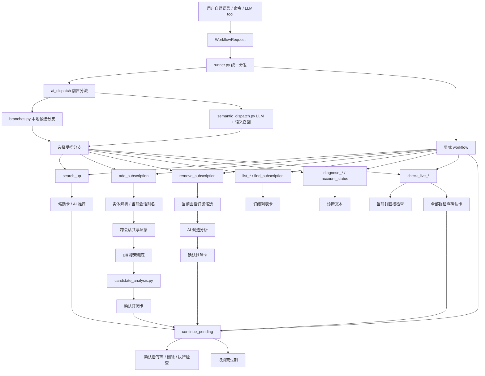
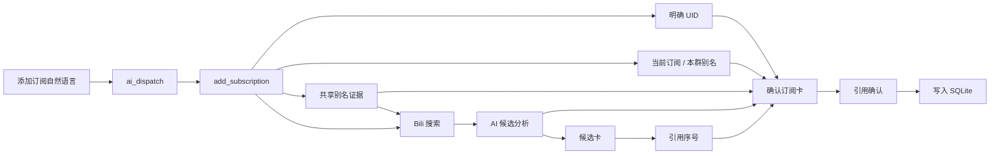
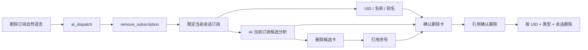
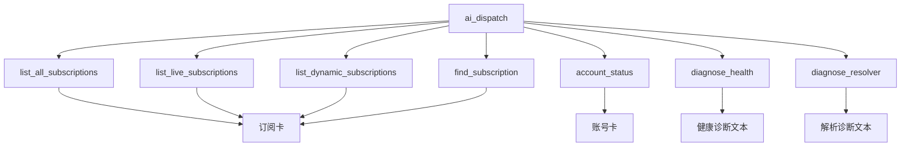
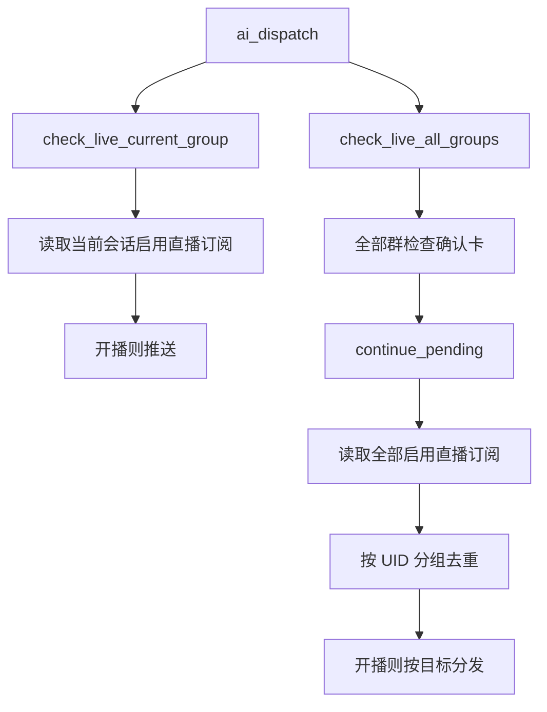

# Bilibili Workflow 图谱

本文档用于快速检查 `astrbot_plugin_bilibili_push` 当前 workflow、分叉关系、AI 介入点和确认边界。后续新增 workflow 时，应同步更新本文档和 `workflows.md`。

VSCode 图形文件：

- `workflows/workflow-map.drawio`: 用 VSCode Draw.io Integration 扩展打开，可图形化查看和编辑。
- `workflows/workflow-map.mmd`: Mermaid 源文件，可用 Mermaid 预览扩展打开，也便于 diff。

## 总览

## AI 可选分叉

| 分叉 | 实际 workflow | 类型 | 是否写库 | 是否确认 | 说明 |
| --- | --- | --- | --- | --- | --- |
| `search_up` | `search_up` | 只读 | 否 | 否 | 搜索 UP，纯搜索不会转订阅 |
| `add_dynamic` | `add_subscription` | 写操作前置 | 否 | 是 | 添加动态订阅，确认后写库 |
| `add_live` | `add_subscription` | 写操作前置 | 否 | 是 | 添加直播订阅，确认后写库 |
| `add_both` | `add_subscription` | 写操作前置 | 否 | 是 | 同时添加动态和直播，确认后写库 |
| `remove_dynamic/live/both` | `remove_subscription` | 写操作前置 | 否 | 是 | 删除当前会话订阅，确认后删除 |
| `list_all_subscriptions` | `list_all_subscriptions` | 只读 | 否 | 否 | 查看当前会话全部订阅 |
| `list_live_subscriptions` | `list_live_subscriptions` | 只读 | 否 | 否 | 查看当前会话直播订阅 |
| `list_dynamic_subscriptions` | `list_dynamic_subscriptions` | 只读 | 否 | 否 | 查看当前会话动态订阅 |
| `find_subscription` | `find_subscription` | 只读 | 否 | 否 | 在当前会话订阅和历史别名中查找 |
| `account_status` | `account_status` | 只读 | 否 | 否 | 查看账号池状态 |
| `diagnose_health` | `diagnose_health` | 只读 | 否 | 否 | 检查数据库、账号池、pending、调度器和渲染器 |
| `diagnose_resolver` | `diagnose_resolver` | 只读 | 否 | 否 | 查看别名命中、搜索回退和歧义统计 |
| `check_live_current_group` | `check_live_current_group` | 请求型 | 否 | 否 | 手动检查当前会话直播订阅 |
| `check_live_all_groups` | `check_live_all_groups` | 请求型 | 否 | 是 | 需要确认后检查全部群直播订阅 |
| `continue_pending` | `continue_pending` | 续跑 | 视任务而定 | 已由任务决定 | 处理引用序号、确认和取消 |

## 关键链路

### 添加订阅

### 删除订阅

### 管理与诊断

### 直播检查

## 确认边界

- `add_subscription` 不直接写库；明确 UID、高置信候选、候选序号选择后都必须进入确认卡。
- `remove_subscription` 只在当前会话订阅内定位目标，确认删除后才删除。
- `check_live_all_groups` 会触发全局直播请求，必须先生成确认任务。
- `search_up`、`list_*`、`find_subscription`、`account_status`、`diagnose_*` 都是只读，不需要确认。
- `continue_pending` 只接受引用消息、唯一 pending 兜底或明确短词，避免普通聊天误触。
- 跨会话共享别名只在至少两个会话确认同一 UID 且无竞争 UID 时自动推进；有冲突时降级到搜索或候选卡。

## 维护说明

- 新增 workflow: 先改 `models.py` 和 `runner.py`，再在 `branches.py` 加受控分支。
- 新增 AI 可选分支: 必须加入 `ALLOWED_NEXT_WORKFLOWS`，并确认 `semantic_dispatch.py` 的 prompt 使用动态 allowed list。
- 新增写操作: 必须有 pending task 和确认卡，不能由 LLM 直接写库。
- 新增请求型操作: 至少要评估限频、确认边界和日志输出。
