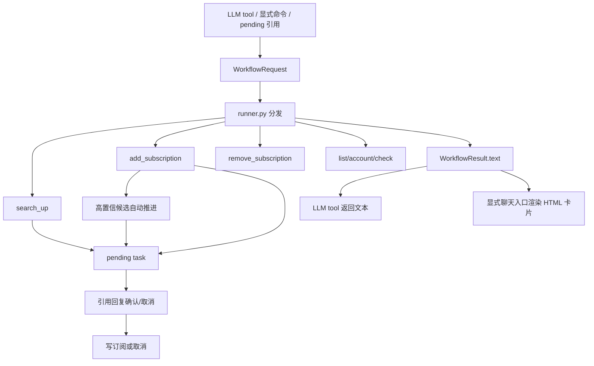

# workflows 模块

`workflows` 放 Bilibili AI workflow 编排层。它把 LLM tool、显式命令和 pending 续跑统一成 `WorkflowRequest`，再分发到具体业务 handler。

## 文件职责

- `models.py`: workflow 定义、别名、确认/取消词。
- `parsing_tool.py`: LLM tool 参数解析。
- `parsing_command.py`: 显式 workflow 命令和 pending 短命令解析。
- `parsing_natural.py`: 本地自然语言意图解析。
- `runner.py`: workflow 分发表。
- `runtime.py`: 事件文本、引用消息文本包、会话来源和 tool event 适配。
- `markers.py`: 将后台 task id 编码为不可见 marker，用于引用消息续跑。
- `results.py`: workflow 文本结果和可选卡片数据结构。
- `cards.py`: 将搜索候选、订阅列表、账号状态和订阅变更转换为模板数据。
- `presenter.py`: 显式聊天入口的 HTML 模板渲染和消息组件组装。
- `pending.py`: pending task 创建、引用 marker 解析、候选选择和确认续跑。
- `pending_store.py`: pending task KV 持久化、匹配、过期清理。
- `search.py`: UP 主搜索 workflow。
- `selection.py`: 高置信候选选择器，仅用于自动分支推进。
- `subscription.py`: 添加、确认添加和删除订阅 workflow。
- `manage.py`: 订阅列表、账号状态和诊断 workflow。
- `formatting.py`: workflow 输出文本格式化。
- `filters.py`: AstrBot pending shortcut filter。

## 维护说明

- `main.py` 只注册入口，不承载 workflow 业务。
- `handlers/ai_handler.py` 只做 Agent 入口和旧工具兼容。
- workflow handler 返回 `WorkflowResult`，其中 `text` 是后端和 LLM 工具使用的稳定文本。
- 显式命令和 pending 续跑可通过 `presenter.py` 把 `WorkflowResult.cards` 渲染为 HTML 图片卡片。
- LLM tool 只返回 `WorkflowResult.text`，不要把图片消息组件传给模型。
- 用户侧不展示 task id；显式聊天入口会在文本中附加不可见 marker，pending 入口会从引用消息文本包解析 marker 并续跑。
- `bili<任务ID>` 显式输入仍保留为兼容入口，但不作为主引导文案。
- 搜索候选多于 0 个时，如果要写订阅，必须先生成 pending task 并确认。
- 明确 UID 的添加订阅可以直接写库，但仍限定当前会话。
- 删除订阅必须使用当前事件的 `unified_msg_origin`。
- pending task 默认写入 AstrBot KV，重载插件后仍可在有效期内继续。
- 新增 workflow 时先在 `models.py` 增加别名和说明，再在 `runner.py` 注册 handler，并同步 `handlers/ai_handler.py` 的系统提示。
- workflow 不直接发送消息；显式聊天入口统一经 `presenter.py` 渲染，LLM tool 统一返回文本。
- pending 任务需要包含可恢复的完整 payload，不能依赖内存对象或一次性事件状态。
- 自动分支推进只能推进流程节点，不允许绕过最终确认写库。

## 当前 workflow

- `search_up`
- `add_subscription`
- `remove_subscription`
- `list_subscriptions`
- `account_status`
- `check_status`
- `continue_pending`

## 工作图谱

需要用户确认的节点：搜索结果多候选、模糊添加订阅、订阅写入前确认和 pending 续跑。明确 UID 的当前会话订阅可直接执行，删除订阅必须限定当前会话。

## 自动分支推进

- `add_subscription` 遇到模糊 UP 名称时会先搜索候选。
- 仅 AI tool 和自然语言入口启用自动分支推进；显式 workflow 命令仍展示候选卡片让用户选择。
- 如果候选匹配度超过 `ai_auto_select_confidence`，且领先其他候选足够明显，workflow 会自动选中该候选并进入确认订阅流程。
- 自动推进不会直接写库；最终写入仍需要用户引用确认卡片回复“确认”。
- 可通过 `enable_ai_auto_select_candidates=false` 关闭，或调高 `ai_auto_select_confidence` 降低误选概率。

## 聊天卡片

- `search_up` 和模糊 `add_subscription`: 使用 `workflow_candidates.html.jinja` 展示候选 UP 和引用回复方式。
- `list_subscriptions`: 使用 `sub_list.html.jinja` 展示当前会话订阅。
- `account_status`: 使用 `sub_list.html.jinja` 展示账号池状态。
- 确认 pending: 使用 `workflow_confirm.html.jinja` 展示引用回复确认和取消方式。
- `add_subscription` 和 `remove_subscription` 成功后: 使用 `sub_add.html.jinja` 展示订阅变更。
- `check_status` 仍保持纯文本，避免诊断信息被卡片截断。

## 验证

- workflow 注册、命令和工具检查：`python scripts/check_workflow_integration.py`。
- AstrBot 运行时导入检查：使用 AstrBot venv 导入插件入口。
- 修改 pending 或 marker 后，需要人工验证引用回复序号、确认和取消三条路径。
