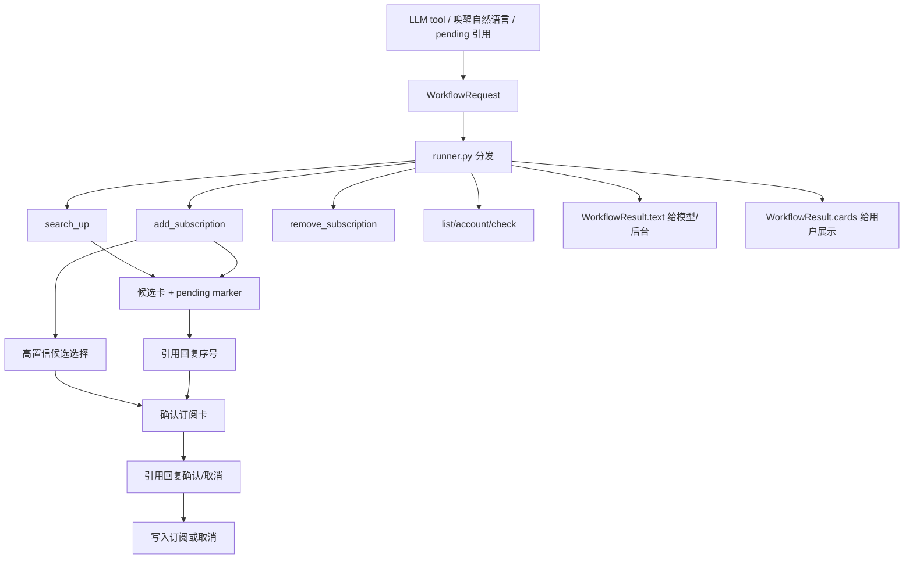

# workflows 模块

`workflows` 是 Bilibili 插件的 AI workflow 编排层。它把 LLM tool、被唤醒后的自然语言意图、pending 引用续跑统一成 `WorkflowRequest`，再分发给具体业务 handler。

## 文件职责

- `models.py`: workflow 定义、别名、确认/取消词。
- `parsing_tool.py`: LLM tool 参数解析。
- `parsing_natural.py`: 被唤醒消息的本地自然语言意图解析与 UP 关键词抽取。
- `parsing_pending.py`: 引用 pending 卡片时解析任务引用。
- `runner.py`: workflow 分发表。
- `runtime.py`: 事件文本、引用消息文本包、会话来源和 tool event 适配。
- `markers.py`: 把后台 task id 编码为不可见 marker，供引用消息续跑。
- `results.py`: workflow 文本结果和可选卡片结构。
- `cards.py`: 把候选、订阅列表、账号状态、确认和订阅变更转换为模板数据。
- `presenter.py`: 把 `WorkflowResult.cards` 渲染为 HTML 图片卡片并组装 AstrBot 消息。
- `pending.py`: pending task 创建、候选选择、确认/取消续跑。
- `pending_store.py`: pending task KV 持久化、匹配、过期清理。
- `search.py`: UP 主搜索 workflow。
- `selection.py`: 高置信候选选择器。
- `subscription.py`: 添加、确认添加和删除订阅 workflow。
- `manage.py`: 订阅列表、账号状态和诊断 workflow。
- `formatting.py`: 只面向后台和 LLM tool 的文本格式化。
- `filters.py`: AstrBot pending 和自然语言 workflow custom filter。

## 当前 workflow

- `search_up`: 搜索 UP 主并返回候选卡。
- `add_subscription`: 按 UID 或关键词进入订阅流程；关键词命中高置信候选时直接进入确认卡。
- `remove_subscription`: 删除当前会话订阅。
- `list_subscriptions`: 列出当前会话订阅。
- `account_status`: 查看账号池状态。
- `check_status`: 输出插件诊断文本。
- `continue_pending`: 处理引用卡片后的序号、确认或取消。

## 工作图谱

## 确认边界

- 模糊 UP 名称添加订阅必须先生成 pending 任务。
- 高置信候选只能自动推进到“确认订阅卡”，不能直接写库。
- 用户必须引用确认卡回复“确认”后才会写入订阅。
- 明确 UID 的添加仍可直接写入当前会话订阅。
- 删除订阅必须限定当前事件的 `unified_msg_origin`。

## 自然语言入口

- `BiliNaturalWorkflowFilter` 只处理已唤醒消息，且文本必须能被 `workflow_from_natural_language()` 解析为 Bilibili workflow。
- 例如“添加b站直播订阅 noworld”会抽取 `noworld` 作为搜索关键词，`live` 作为订阅类型。
- 如果候选匹配度超过 `ai_auto_select_confidence` 且领先其他候选，会直接返回确认卡。
- 若置信度不足，则返回候选卡，用户引用回复序号后再进入确认卡。

## 聊天卡片

- `search_up` 和模糊 `add_subscription`: 使用 `workflow_candidates.html.jinja`。
- 高置信自动选择和候选选择后的订阅确认: 使用 `workflow_confirm.html.jinja`。
- `list_subscriptions`: 使用 `sub_list.html.jinja`。
- `account_status`: 使用 `sub_list.html.jinja`。
- 添加/删除成功: 使用 `sub_add.html.jinja`。
- `check_status` 保持纯文本，避免诊断信息被卡片截断。
- LLM tool 返回给模型的是文本；`handlers/ai_handler.py` 会把卡片作为用户侧消息主动发送。

## 维护说明

- 新 workflow 先在 `models.py` 增加定义和别名，再在 `runner.py` 注册 handler。
- 新用户可见卡片统一走 `WorkflowResult.cards`，不要在业务 handler 中直接拼图片消息。
- pending 任务必须包含可恢复 payload，不能依赖一次性事件状态。
- task id 不直接展示给用户；用户侧使用引用消息续跑，后台用不可见 marker 解析真实 task id。
