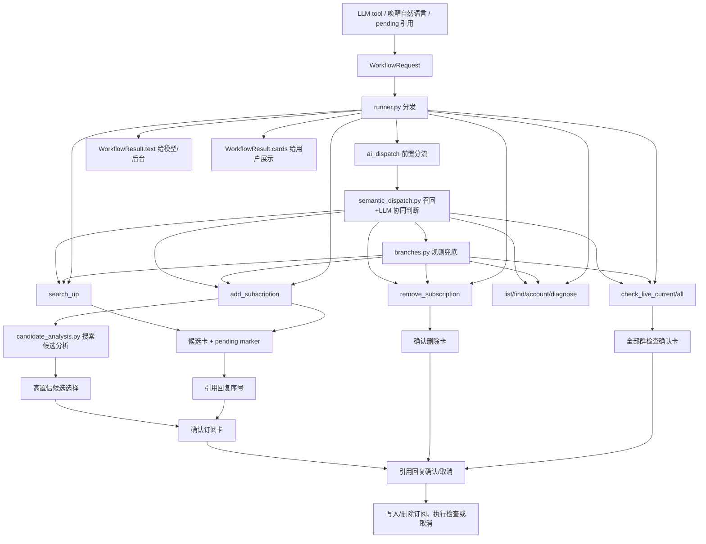

# workflows 模块

`workflows` 是 Bilibili 插件的 AI workflow 编排层。它把 LLM tool、被唤醒后的自然语言意图、pending 引用续跑统一成 `WorkflowRequest`，再分发给具体业务 handler。

## 文件职责

- `models.py`: workflow 定义、别名、确认/取消词。
- `branches.py`: AI 前置分流可选分支、置信度和选择规则。
- `dispatch.py`: `ai_dispatch` 前置 workflow，负责转入具体业务 workflow。
- `semantic_dispatch.py`: 把规则候选和语义召回候选一起交给当前会话大模型，抽取 workflow、查询词和订阅类型；失败时安静回退。
- `candidate_analysis.py`: B 站搜索返回候选后，把候选名称、排序、粉丝数和本地名称分交给大模型分析，判断是否可进入确认卡。
- `parsing_tool.py`: LLM tool 参数解析。
- `parsing_natural.py`: 被唤醒消息是否进入 `ai_dispatch` 的轻量判断。
- `parsing_pending.py`: 引用 pending 卡片时解析任务引用。
- `runner.py`: workflow 分发表。
- `runtime.py`: 事件文本、引用消息文本包、会话来源和 tool event 适配。
- `markers.py`: 把后台 task id 编码为不可见 marker，供文本兜底或兼容场景引用续跑。
- `results.py`: workflow 文本结果和可选卡片结构。
- `cards.py`: 把候选、订阅列表、账号状态、确认和订阅变更转换为模板数据。
- `presenter.py`: 把 `WorkflowResult.cards` 渲染为 HTML 图片卡片并组装 AstrBot 消息。
- `pending.py`: pending task 创建、候选选择、确认/取消续跑。
- `pending_store.py`: pending task KV 持久化、匹配、过期清理。
- `entity_resolver.py`: UP 主实体解析入口，收集当前订阅/标签、历史别名和跨会话别名证据，按置信度、来源层级和歧义边界选择。
- `resolver_stats.py`: 记录 UP 解析命中、歧义、未命中、Bili 搜索回退和异常摘要，供诊断 workflow 使用。
- `search.py`: UP 主搜索 workflow。
- `selection.py`: 高置信候选选择器。
- `subscription.py`: 添加、确认添加和删除订阅 workflow。
- `manage.py`: 订阅列表、账号状态和诊断 workflow。
- `formatting.py`: 只面向后台和 LLM tool 的文本格式化。
- `filters.py`: AstrBot pending 和自然语言 workflow custom filter。

## 当前 workflow

- `ai_dispatch`: 前置分流 workflow，优先用“规则候选 + 语义召回 + LLM”协同判断自然语言意图，失败或低置信时用规则分支兜底，再转入具体 workflow。
- `search_up`: 搜索 UP 主并返回候选；直接命令和自然语言 workflow 会展示候选卡，LLM tool 默认作为模型内部检索。
- `add_subscription`: 按 UID 或关键词进入订阅流程；UID 和高置信候选都会先进入确认卡。
- `remove_subscription`: 删除当前会话订阅；支持用已确认别名、当前订阅名或 AI 当前订阅候选分析解析 UID，并先进入删除确认卡。
- `list_subscriptions`: 列出当前会话订阅；自然语言明确直播/动态时可按订阅类型过滤。
- `list_all_subscriptions`: 列出当前会话全部订阅，是 `list_subscriptions` 的显式分叉。
- `list_live_subscriptions`: 列出当前会话直播订阅。
- `list_dynamic_subscriptions`: 列出当前会话动态订阅。
- `find_subscription`: 在当前会话订阅、标签和历史别名中查找 UP。
- `account_status`: 查看账号池状态。
- `diagnose_health`: 输出数据库、账号池、pending、调度器和渲染器健康诊断。
- `diagnose_resolver`: 输出 UP 解析、别名命中、搜索回退和歧义统计。
- `check_live_current_group`: 手动检查当前会话直播订阅。
- `check_live_all_groups`: 生成确认任务，用户确认后检查全部群直播订阅。
- `check_status`: 输出插件诊断文本。
- `continue_pending`: 处理引用卡片后的序号、确认或取消。

## 工作图谱

## 确认边界

- 模糊 UP 名称添加订阅必须先生成 pending 任务。
- 高置信候选只能自动推进到“确认订阅卡”，不能直接写库。
- 用户必须引用确认卡回复“确认”后才会写入订阅。
- 明确 UID 添加订阅也必须先生成确认卡，不能由 AI 工具直接写库。
- 删除订阅必须限定当前事件的 `unified_msg_origin`，并引用删除确认卡回复“确认删除”后才会移除。
- 全部群直播检查会触发全局请求，必须引用确认卡回复“确认”后才执行。
- 当前群直播检查只读取当前会话启用直播订阅，可直接执行；后续如增加频繁调用场景，应补冷却。
- 卡片消息默认不发送可见或不可见任务编号，避免 ChatUI 产生空白文本消息；用户引用回复且当前会话只有一个待处理任务时，可按确认词或序号兜底续跑。
- 多个 pending 任务并发时，如果引用消息无法提供 marker，用户需要先处理或清理到单个待处理任务，避免误确认。
- 如果 LLM 工具链在后台生成了唯一待处理任务，用户唤醒回复“确认”“确认删除”“取消”或序号时也可续跑；该兜底只接受明确短词，避免普通聊天误触。

## 自然语言入口

- `BiliNaturalWorkflowFilter` 只处理已唤醒消息，且文本必须能被 `workflow_from_natural_language()` 解析为 Bilibili workflow。
- 被唤醒自然语言先进入 `ai_dispatch`，再由 `branches.py` 选择搜索、添加、删除、列表、账号或诊断分支。
- 管理类分叉会尽量保持只读：列表拆为全部/直播/动态，查找订阅限定当前会话，健康诊断和解析诊断不写库。
- 请求型分叉目前只开放直播检查：当前群直接执行，全部群需要确认。
- `ai_dispatch` 会先构造 `branches.py` 的确定性候选，再用 `entity_resolver.py` 对候选 query 做当前订阅、标签和历史别名召回，最后把两类证据交给当前会话大模型识别意图、UP 查询词和订阅类型。
- LLM 不可直接写库，只能返回后续 workflow；如果 LLM 分流失败、超时、无模型或置信度低于 `ai_semantic_dispatch_confidence`，自动回退到 `branches.py` 的确定性规则。
- 规则回退后，具体 `add_subscription` / `remove_subscription` 仍会执行 `resolve_up_reference -> Bili 搜索 -> 高置信确认/候选卡` 链路。
- 例如“添加b站直播订阅 noworld”会在前置分流中抽取 `noworld` 作为搜索关键词，`live` 作为订阅类型。
- 搜索候选出来后，`candidate_analysis.py` 可让 LLM 结合候选名称、粉丝数、搜索排序和本地名称分判断是否进入确认卡；LLM 失败或低置信时回退到 `selection.py` 的确定性评分。
- 删除订阅找不到明确 UID 时，`candidate_analysis.py` 会在当前会话订阅候选内代理判断；高置信只进入删除确认卡，低置信展示删除候选卡。
- 纯 `search_up` 只会用候选分析高亮推荐结果，不会自动转成订阅流程。
- 如果候选匹配度超过 `ai_auto_select_confidence` 且领先其他候选，会直接返回确认卡。
- 若置信度不足，则返回候选卡，用户引用回复序号后再进入确认卡。
- 用户选择搜索候选或确认订阅后，`entity_resolver.py` 会把本次查询词和 UID 写入 `up_aliases`，并在 `up_alias_evidence` 记录当前会话确认；后续相同会话优先用历史别名直接命中对应 UP。

## 实体解析策略

UP 主解析采用确定性分层，不默认依赖 embedding 或向量库：

- 明确 UID 直接视为最高置信输入。
- 当前会话订阅、用户名和标签优先，适合用户说“之前那个 UP”或群内自定义简称。
- SQLite `up_aliases` 作为历史确认层，当前会话映射优先，全局用户名映射兜底。
- SQLite `up_alias_evidence` 作为共享证据层，只聚合用户确认过的简称；默认至少 2 个不同会话确认同一 UID，且没有竞争 UID，才会进入高置信自动推进。
- 单群外部简称不会自动命中，只能作为后续扩展诊断证据；同一简称出现竞争 UID 时，解析层会把置信度压低，转入 Bili 搜索或候选卡。
- 若多个不同 UID 的候选分差过小，则视为歧义，不自动选择，转入候选卡。
- 上述层未命中时才调用 Bili 搜索；Bili 搜索结果仍需高置信自动选择或用户确认。

如后续要接语义/向量检索，只能作为 Bili 搜索前或搜索后的候选增强层，并且必须失败降级、记录来源、保留用户确认边界。

## 聊天卡片

- `search_up` 和模糊 `add_subscription`: 使用 `workflow_candidates.html.jinja`。
- UID 添加、高置信自动选择、候选选择后的订阅确认和删除确认: 使用 `workflow_confirm.html.jinja`。
- `list_subscriptions`: 使用 `sub_list.html.jinja`。
- `account_status`: 使用 `sub_list.html.jinja`。
- 添加/删除成功: 使用 `sub_add.html.jinja`。
- `check_status` 保持纯文本，避免诊断信息被卡片截断。
- `diagnose_health` 和 `diagnose_resolver` 保持纯文本，便于复制排查。
- `check_live_current_group` 保持纯文本结果；`check_live_all_groups` 使用确认卡。
- LLM tool 返回给模型的是文本；`handlers/ai_handler.py` 默认不主动发送卡片，避免模型快速调用多个工具时刷屏。只有参数显式包含 `present`、`foreground` 或 `show_card` 时，工具结果才会渲染到聊天侧。
- 直接命令和被唤醒的自然语言 workflow 不经过 `AiToolHandler` 的后台策略，仍会按 `WorkflowResult.cards` 展示用户需要操作的卡片。

## 维护说明

- 新 workflow 先在 `models.py` 增加定义和别名，再在 `runner.py` 注册 handler。
- 新 AI 分支先在 `semantic_dispatch.py` 和 `branches.py` 增加可选分支；如需要召回辅助，复用 `entity_resolver.py` 的可解释候选，不在分流层直接查写业务表。
- 搜索候选层的 AI 只能返回推荐候选和理由；高置信也只能进入确认卡，不得直接调用写库逻辑。
- 新用户可见卡片统一走 `WorkflowResult.cards`，不要在业务 handler 中直接拼图片消息。
- 新 LLM tool 默认保持后台处理；只有能保证单条最终确认或用户明确要求展示时，才设置 `present=true`。
- pending 任务必须包含可恢复 payload，不能依赖一次性事件状态。
- task id 不直接展示给用户；文本兜底可用不可见 marker 解析真实 task id，卡片路径优先依赖当前会话 pending 兜底。
- 实体解析层必须保持可解释：当前订阅和 SQLite 别名优先，Bili 搜索兜底；如后续接向量检索，只能作为候选增强，不得直接写库。
- `check_status` 会输出 resolver 摘要；如果命中率异常下降，优先检查别名学习、当前会话 target 和 Bili 搜索返回。

## 前台展示策略

- 当前订阅、标签和历史别名命中都属于后台证据，不直接把“历史别名命中”之类的解释抛给用户。
- `search_up` 命中历史别名时仍返回正常候选卡片；用户需要继续选择时引用卡片序号即可。
- `add_subscription` 和 `remove_subscription` 高置信命中时直接进入最终确认卡，不额外发送候选分析文本。
- 候选分析理由保留在后端 workflow 判断中；前台只展示用户需要操作的卡片或最终结果，避免 ChatUI 刷屏。
